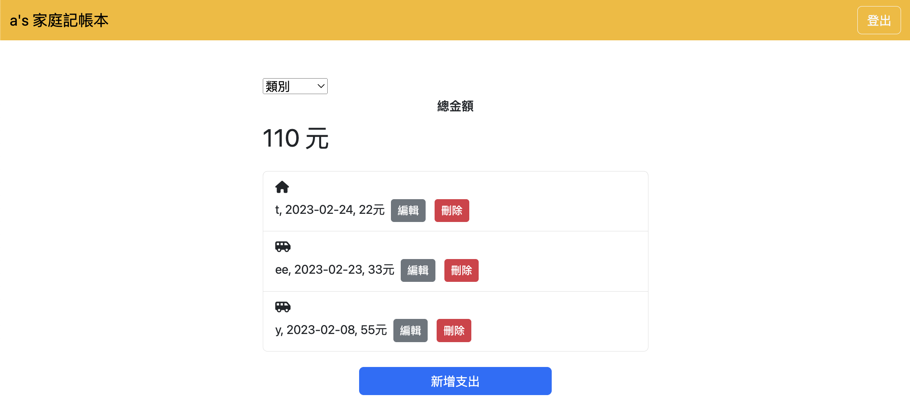

# 餐廳清單.Final


## 介紹
學期3(後端), week 2, A3:老爸的私房錢

### 功能
* 使用者可以註冊自己的帳號
* 使用者可以新增支出
* 使用者可以瀏覽全部所有支出也可以依照分類看支出
* 使用者可以修改支出
* 使用者可以刪除支出


## 開始使用
* 確認安裝npm, Node.js
* 將專案clone到本地
* 本地開啟後，透過終端機進入資料夾，輸入：```npm install```
* 安裝完畢後，輸入：```npm start```
* 成功的話會在終端機看到：```Express is running on http://localhost:3000```
```mongodb connected!```
* 打開瀏覽器進入：```http://localhost:3000```
* 欲暫停，輸入：```control + c```

## 開發工具
* Node.js 18.12.1
* Express 4.18.2
* Express-Handlebars 4.0.2
* Bootstrap 5.2.1
* mongoose 6.9.0
* dotenv 16.0.3
* bcryptjs 2.4.3
* connect-flash 0.1.1
* express-session 1.17.3
* method-override 3.0.0
* passport 0.4.1
* passport-local 1.0.0